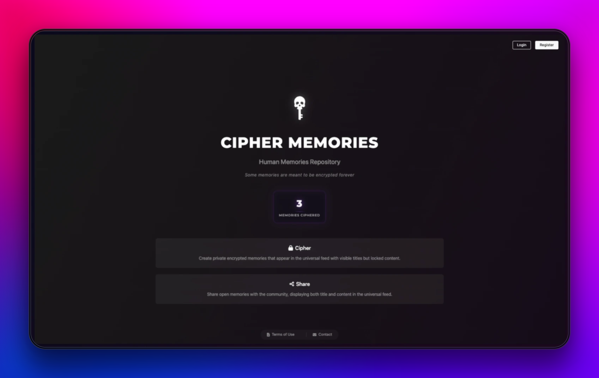
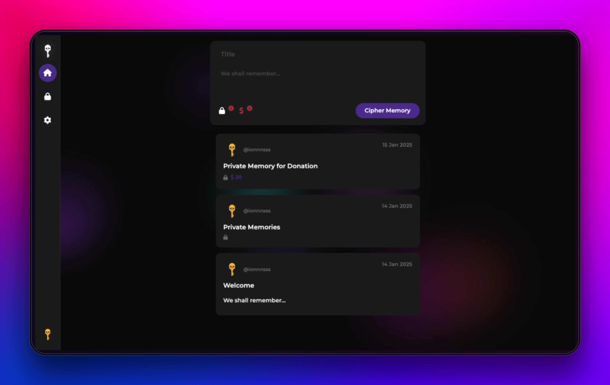
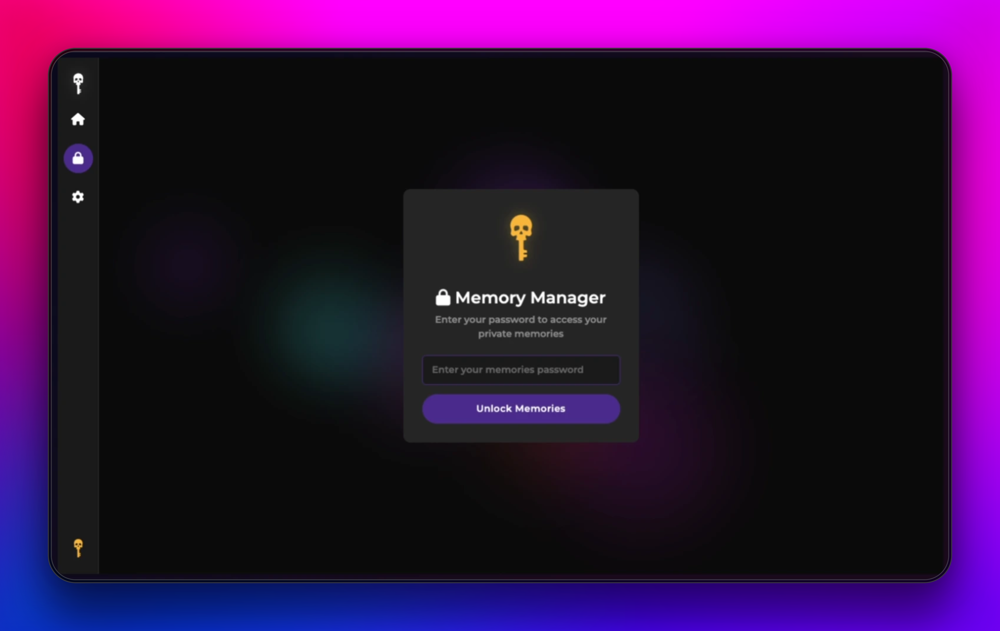
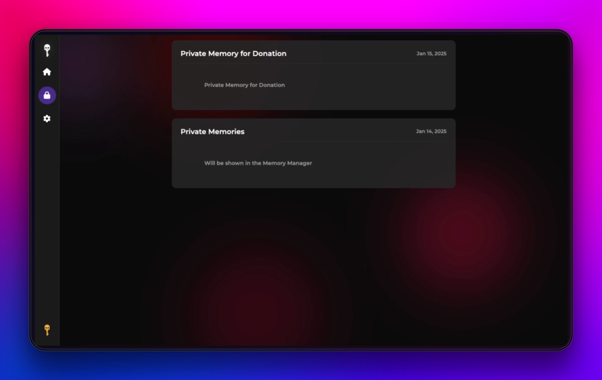
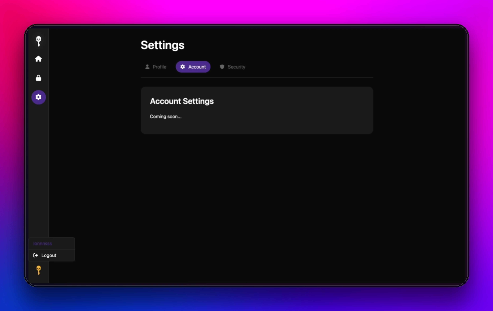
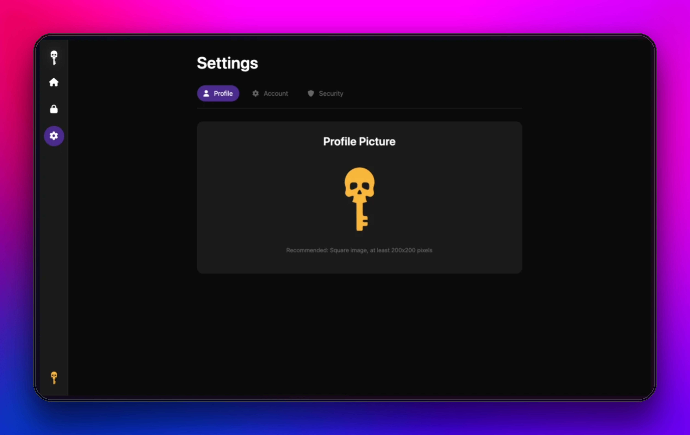

# Cipher Memories

Cipher Memories is a platform for storing and sharing encrypted personal memories. The platform allows users to create both private encrypted memories (personal and donations) and public shared memories, providing a secure space for preserving digital content.

I starteded this project to learn Go and web development. I begin as something exploratory and playful, but I'm trying to make it more useful and functional.

I thought about this project as a Human Memory Repository, where we can store our memories and share them with humanity for years to come.

🔗 [Visit Cipher Memories](https://ciphermemories.com)

### Home Page

## Features

### 🔒 Private Encrypted Memories
- Create private memories with encrypted content
- Memories appear in the universal feed with visible titles but locked content
- Access private memories through the Memory Manager with your password

### 💰 Private Encrypted Memories for Donations
- Donate memories to Cipher Memories
- Memories appear in the universal feed with visible titles but locked content
- Other users can unlock your memories paying the amount you set for each memory

### 📢 Public Shared Memories
- Share open memories with the community
- Display both title and content in the universal feed
- Build a collection of shared experiences

Memory Feed Screenshot

### 🔑 Memory Manager
- Secure access to private memories
- Password-protected memory management
- Centralized control of your encrypted content

Memory Manager Screenshot

### ⚙️ User Settings
- Profile customization (only avatar available)
- Account management (soon)
- Security settings (soon)

Settings Screenshot

